# System Design And Architecture

> Organizing components structures and behaviors for any simple to complex system.

Systems design interfaces, and data for an electronic control system to satisfy specified requirements. System design
could be seen as the application of system theory to product development.

## Table of contents

1. Scalability
    - Single Server
    - Separating out the database
    - Vertical Scaling
    - Horizontal Scaling
2. Fail-over Strategies
    - Cold Standby
    - Warm Standby
    - Hot Standby
3. Sharding Databases
    - MongoDB sharding example
    - Cassandra sharding example
    - Gossip Protocol
    - Sharded Databases are "NoSQL"
    - Normalization vs Denormalization
4. Data Lakes
5. ACID compliance
6. CAP Theorem
    - Example Databases
7. Caching
    - Eviction strategies for Caching
    - Popular Caching Technologies
8. Content Delivery Networks (CDNs)
9. Resiliency
10. Algorithms and Data Structures
11. Working with Big Data
12. Design Interview Strategies
13. Mock Design Interviews
14. General Tech Interview Tips

### Youtube

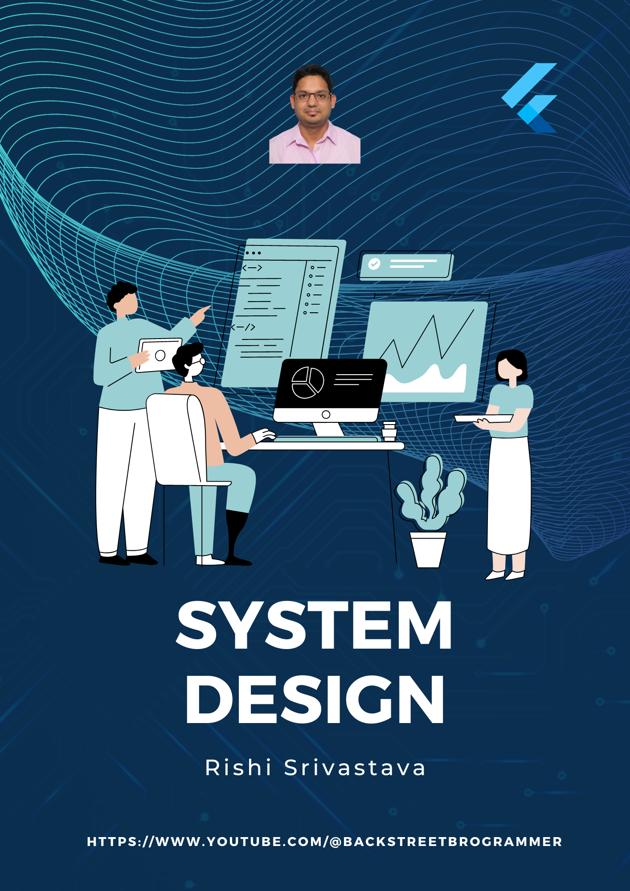

---

### Chapter 01. Scalability

#### Single server

Maintain a single server - mainly an HTTP server to service clients web requests.

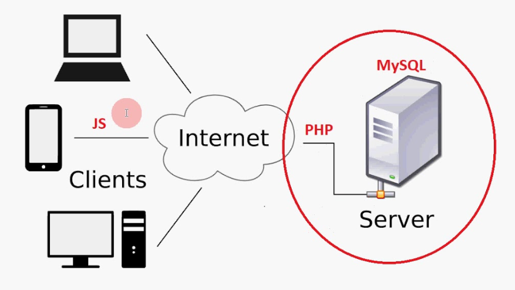

Disadvantage: Single point of failure.

#### Separating out the database

By separating out the database from the web server node, we can scale both web server node and database node
independently. However, there is still a single point of failure.

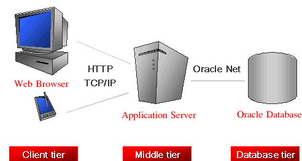

#### Vertical Scaling

It is defined as the process of increasing the capacity of a single machine by adding more resources such as memory,
storage, etc. to increase the throughput of the system. No new resource is added, rather the capability of the existing
resources is made more efficient.

Example: `MySQL`

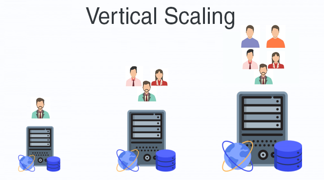

However, there is still a single point of failure. Also, there is a limit to the capacity of a single machine.

#### Horizontal Scaling

It is defined as the process of adding more instances of the same type to the existing pool of resources and not
increasing the capacity of existing resources like in vertical scaling. This kind of scaling also helps in decreasing
the load on the server.

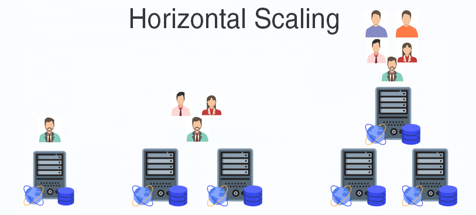

In this process, the number of servers is increased and not the individual capacity of the server. This is done with the
help of a **Load Balancer** which basically routes the user requests to different servers according to the availability
of the server. Thereby, increasing the overall performance of the system. In this way, the entire process is distributed
among all servers rather than just depending on a single server.

Example: NoSQLs like `Cassandra` and `MongoDB`

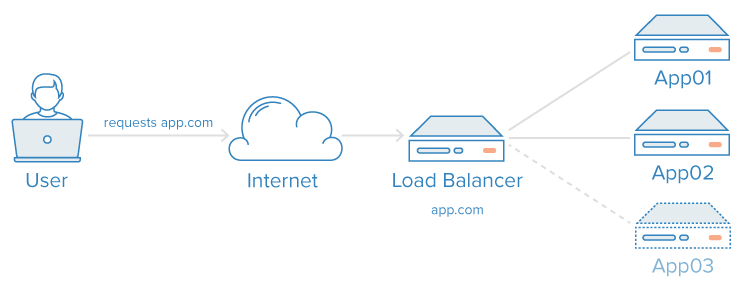

All the nodes are "**stateless**" meaning that each node doesn't maintain the state of client requests. In other words,
any node can serve client request without maintaining the state => however, the database can store all the clients
request and service states.

So we should choose vertical scaling or horizontal scaling based on the system architecture (big or small), user base,
web traffic expected etc.

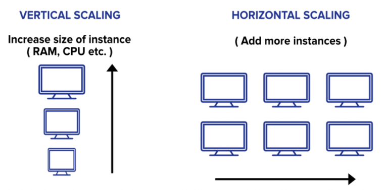

---

### Chapter 02. Fail-over Strategies

#### Servers are provisioned as:

- Own company's data centers
- Cloud services: Amazon EC2, Google Compute Engine, Azure VM's, etc.
- Fully managed "serverless" services: Lambda, Kinesis, Athena, etc.

#### Failover servers: Cold Standby

Periodic backup of data is done on the current primary server. The storage device can be anything like external hard
disk, magnetic tape, etc. Once the current primary server goes down - the standby server is "prepared" to be in same
state as primary from the backup storage.

Drawback: may take time to prepare the standby server and data will be lost during this time.

#### Failover servers: Warm Standby

Instead of doing periodic backup, we can replicate data in realtime. Data replication is already available in major
databases which will automatically sync up the data to standby server in realtime.

#### Failover servers: Hot Standby

Servers can directly write to all the different databases (primary, secondary, etc.) in a distributed fashion.
Similarly, the servers can also do distributed reads from all the databases. Thus, any failure of a single database host
will have minimal impact on data loss.

---

### Chapter 03. Sharding Databases

Database sharding is a type of horizontal partitioning that splits large databases into smaller components, which are
faster and easier to manage. A shard is an individual partition that exists on separate database server instance to
spread load. Auto sharding or data sharding is needed when a dataset is too big to be stored in a single database.

As both the database size and number of transactions increase, so does the response time for querying the database.
Costs associated with maintaining a huge database can also skyrocket due to the number and quality of computers we need
to manage our workload. Data shards, on the other hand, have fewer hardware and software requirements and can be managed
on less expensive servers.

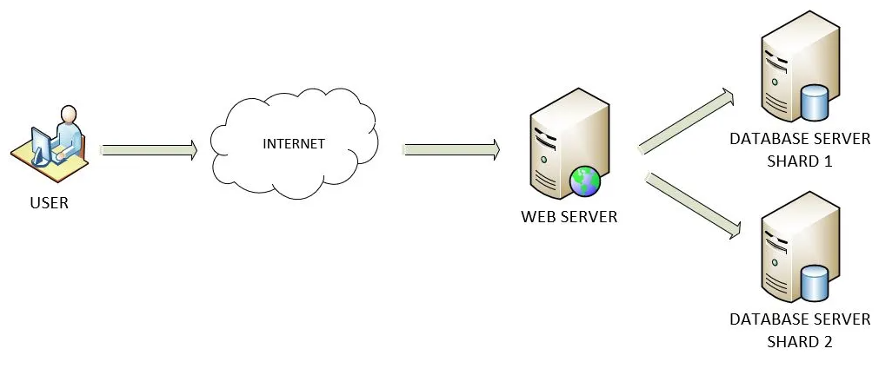

Based on some data field or hash key, shards can be selected and stored the data into. Each shard also replicates the
data to other shards for hot standby fail-over recovery.

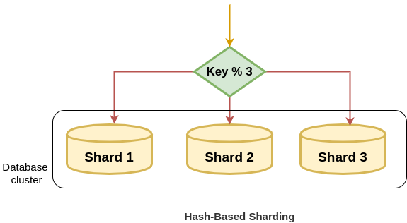

#### MongoDB sharding example

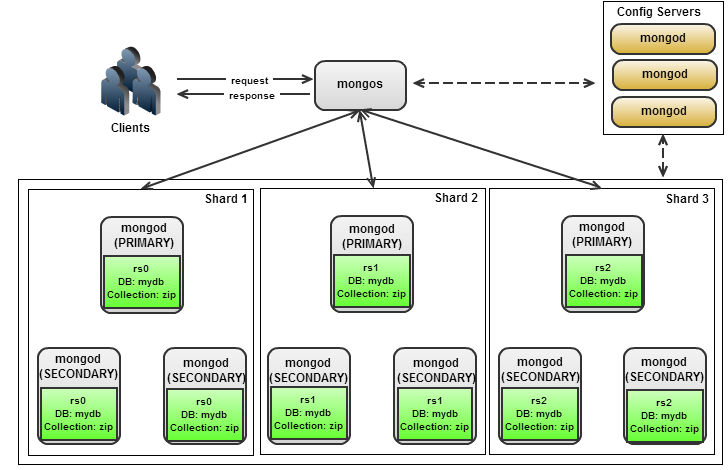

1. Each Replica Server is a "shard" and it contains Primary nodes and several secondary nodes
2. Primary node works as a router to distribute the data amongst various secondary nodes
3. If Primary node goes down => one of the secondary nodes becomes primary automatically until primary goes up again
4. All the information about primary nodes, partitioning key, etc. is stored in Config Servers
5. Config Server is also having 2-3 nodes same as Primary -> Secondary as for Replica Set / Shards

_Drawback_

Need to maintain lots of servers and thus, it's expensive.

#### Cassandra sharding example

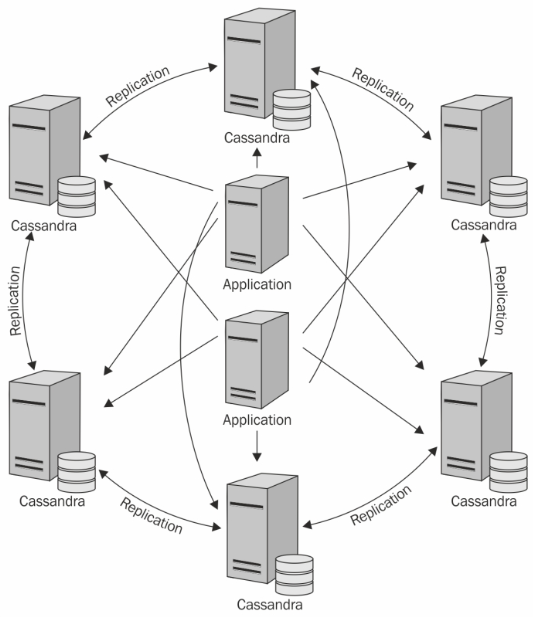

Since it is a distributed database, Cassandra can (and usually does) have multiple nodes. A node represents a single
instance of Cassandra. These nodes communicate with one another through a protocol called **gossip**, which is a process
of computer peer-to-peer communication. Cassandra also has a master-less architecture (no primary / secondary node
concept) – any node in the database can provide the exact same functionality as any other node – contributing to
Cassandra’s robustness and resilience. Multiple nodes can be organized logically into a cluster, or "ring". We can also
have multiple datacenters.

Eventual consistency is a consistency model used in distributed computing to achieve high availability that informally
guarantees that, if no new updates are made to a given data item, eventually all accesses to that item will return the
last updated value.

#### Gossip Protocol

A gossip protocol or epidemic protocol is a procedure or process of computer peer-to-peer communication that is based on
the way epidemics spread. Some distributed systems use peer-to-peer gossip to ensure that data is disseminated to all
members of a group. Some ad-hoc networks have no central registry and the only way to spread common data is to rely on
each member to pass it along to their neighbors.

The Gossip protocol is used to repair the problems caused by **multicasting**; it is a type of communication where a
piece of information or gossip in this scenario, is sent from one or more nodes to a set of other nodes in a network.
This is useful when a group of clients in the network require the same data at the same time. But there are many
problems that occur during multicasting, if there are many nodes present at the recipient end, latency increases; the
average time for a receiver to receive a multicast.

To get this multicast message or gossip across the desired targets in the group, the gossip protocol sends out the
gossip periodically to **random nodes** in the network, once a random node receives the gossip, it is said to be
infected due to the gossip. Now the random node that receives the gossip does the same thing as the sender, it sends
multiple copies of the gossip to random targets. This process continues until the target nodes get the multicast. This
process turns the infected nodes to uninfected nodes after sending the gossip out to random nodes.

#### Sharded Databases are "NoSQL"

- Most "NoSQL" databases actually do support SQL operations and use SQL as their API
- A formal schema may not be needed and can support unstructured data
- Works best with simple key-value lookups
- Tough to do **joins** across shards
- Re-sharding is very inefficient process
- Hotspots Celebrity problem: a single shard may contain most of the data and the load may not be distributed properly
- Examples: MongoDB, Cassandra, DynamoDB, HBase

#### Normalization vs Denormalization

**Normalization** is the method used in a database to reduce the data redundancy and data inconsistency from the table.
It is the technique in which non-redundancy and consistency data are stored in the set schema. By using normalization,
the number of tables is increased.

**Denormalization** is used to add the redundancy to execute the query quickly. It is a technique in which data are
combined to execute the query quickly. By using denormalization, the number of tables is decreased.

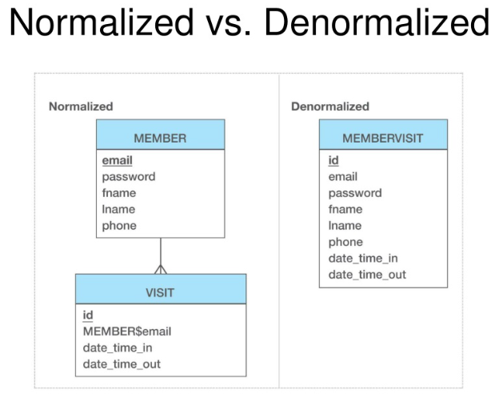

| S.No.          | Normalization                                                | Denormalization                                    |
|----------------|--------------------------------------------------------------|----------------------------------------------------|
| 1              | Non-redundancy and consistency data are stored in set schema | Flexible schema                                    |
| 2              | Data redundancy and inconsistency is reduced                 | Redundancy is added for quick execution of queries |
| 3              | Minimizes data footprint                                     | Can inflate data sizes and slow data ingest        |
| 4              | Can lead to expensive joins                                  | Data is pre-joined in single table to avoid joins  |

---

### Chapter 04. Data Lakes

- Common approach for **big unstructured data** is to put all of it into text files (csv, json, etc.) or logs and store
  into a big distributed storage system like **Amazon S3** => this is called a **"data lake"**.
- Another process **Amazon Glue** will create a schema for the data
- Other cloud-based features let us query the data:
    - **Amazon Athena** (serverless)
    - **Amazon Redshift** (distributed data warehouse)

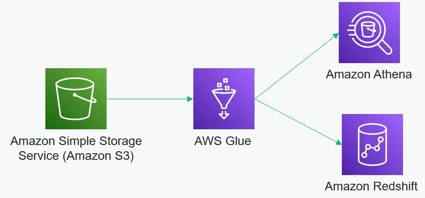

---

### Chapter 05. ACID compliance

ACID, an acronym for "Atomicity, Consistency, Isolation, and Durability" is a set of principles that ensure database
transactions are processed reliably. When any data storage system upholds these principles, it is said to be ACID
compliant.

**Atomicity**:
> Atomicity means that we guarantee that either all the transaction succeeds or none of it does. We don’t get part
> of it succeeding and part of it not. If one part of the transaction fails, the whole transaction fails.
> With atomicity, it’s either “all or nothing”.

**Consistency**:
> This ensures that we guarantee that all data will be consistent. All data will be valid according to all defined
> rules, including any constraints, cascades, and triggers that have been applied on the database.

**Isolation**:
> Guarantees that all transactions will occur in isolation. No transaction will be affected by any other transaction.
> So a transaction cannot read data from any other transaction that has not yet completed.

**Durability**:
> Durability means that, once a transaction is committed, it will remain in the system – even if there’s a system crash
> immediately following the transaction. Any changes from the transaction must be stored permanently. If the system
> tells the user that the transaction has succeeded, the transaction must have, in fact, succeeded.

---

### Chapter 06. CAP Theorem

The CAP theorem, also named Brewer's theorem after computer scientist Eric Brewer, states that any distributed data
store can provide only two of the following three guarantees:

1. **Consistency**: Every read receives the most recent write or an error.
2. **Availability**: Every request receives a (non-error) response, without the guarantee that it contains the most
   recent write.
3. **Partition-tolerance**: The system continues to operate despite an arbitrary number of messages being dropped (or
   delayed) by the network between nodes.

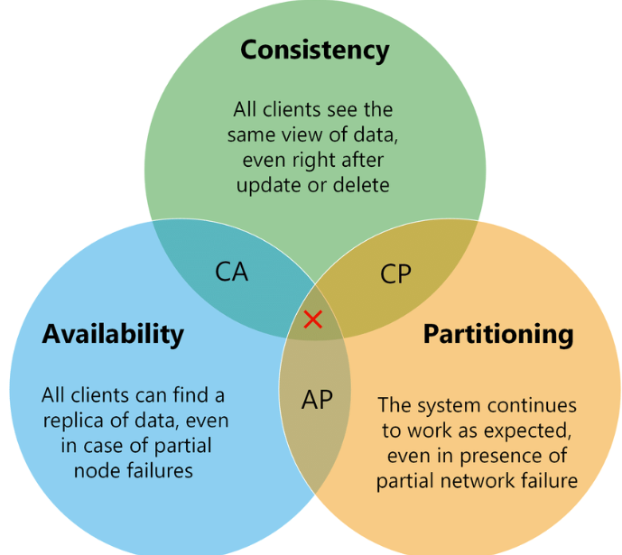

When a network partition failure happens, it must be decided whether to do one of the following:

- cancel the operation and thus decrease the availability but ensure consistency
- proceed with the operation and thus provide availability but risk inconsistency

Thus, if there is a **network partition**, one has to choose between **consistency** or **availability**. Note that
consistency as defined in the CAP theorem is quite different from the consistency guaranteed in ACID database
transactions.

Eric Brewer argues that the often-used "two out of three" concept can be somewhat misleading because system designers
need only to sacrifice consistency or availability in the presence of partitions, but that in many systems partitions
are rare.

#### Example Databases

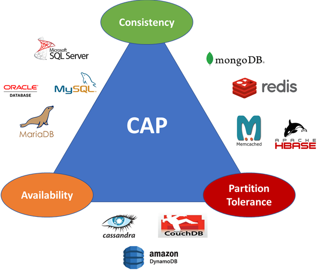

- **MySQL**: **Available** and **Consistent** but not as flexible for horizontal scaling or **Partition-Tolerant**
- **MongoDB**: **Consistent** and **Partition-Tolerant** but because of single master => trade-off is **Availability**
- **Cassandra**: **Availability** and **Partition-Tolerant** but no single master => trade-off is eventually consistent

---

### Chapter 07. Caching

In computing, a cache is a high-speed data storage layer which stores a subset of data, typically transient in nature,
so that future requests for that data are served up faster than is possible by accessing the data’s primary storage
location. Caching allows us to efficiently reuse previously retrieved or computed data.

The data in a cache is generally stored in fast access hardware such as RAM (Random-access memory) and may also be used
in correlation with a software component. A cache's primary purpose is to increase data retrieval performance by
reducing the need to access the underlying **slower** storage layer.

Trading off capacity for speed, a cache typically stores a subset of data transiently, in contrast to databases whose
data is usually complete and durable.

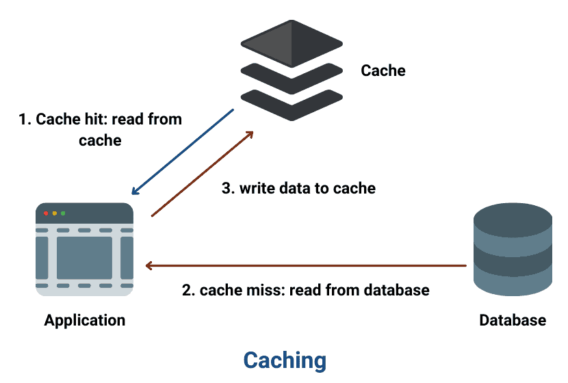

Few points about caching:

- Cache servers are **horizontally scaled** servers
- Application web servers may use some **hashing mechanism** on requests to search from a particular cache server
- Its **in-memory** and fast and most appropriate for applications with more reads than writes
- **Expiration policy** is crucial as it dictates how long the data is cached:
    - too long and the data may go stale
    - too short and the cache won't do much good
- May be effected by **Hotspots** or **Celebrity problem**: very popular data sitting on a cache server will be searched
  much more than other not-so-popular data on another cache server; thus one cache server having most of the traffic
- **Cold-start** may be a problem, meaning that when system starts - cache will be empty and all the initial requests
  will hit the underlying database hampering the performance until the cache is fully warmed up

#### Eviction strategies for Caching

- LRU (Least Recently Used)

> The Least Recently Used (LRU) cache is a cache eviction algorithm that organizes elements in order of use. In LRU, as
> the name suggests, the element that hasn't been used for the longest time will be evicted from the cache.

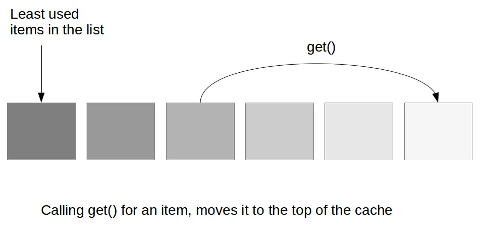

- LFU (Least Frequently Used)

> Least Frequently Used (LFU) is a caching algorithm in which the least frequently used cache block is removed whenever
> the cache is overflowed. In LFU we check the old page as well as the frequency of that page and if the frequency of
> the page is larger than the old page we cannot remove it and if all the old pages are having same frequency then take
> last i.e. FIFO method for that and remove that page.

- FIFO (First In First Out)

> Elements inserted first are the one which are removed first, or in other words, the oldest elements in cache are
> evicted.

#### Popular Caching Technologies

- Memcached

> Memcached is an in-memory key-value store for small chunks of arbitrary data (strings, objects) from results of
> database calls, API calls, or page rendering.

- Redis

> Redis is an open source, in-memory, key-value data store most commonly used as a primary database, cache, message
> broker, and queue.

- NCache

> NCache is an Open Source in-memory distributed cache for .NET, Java, Node.js and Scala applications.

- Ehcache

> Ehcache is an open source library implemented in Java for implementing caches in Java programs, especially local and
> distributed caches in main memory or on the hard disk.

- ElastiCache

> Amazon ElastiCache is a fully managed in-memory data store and cache service by Amazon Web Services.

---

### Chapter 08. Content Delivery Networks (CDNs)

A content delivery network (CDN) refers to a geographically distributed group of servers which work together to provide
fast delivery of Internet content.

A CDN allows for the quick transfer of assets needed for loading Internet content including HTML pages, javascript
files, stylesheets, images, and videos.

The goal is to provide high availability and performance by distributing the service spatially relative to end users.

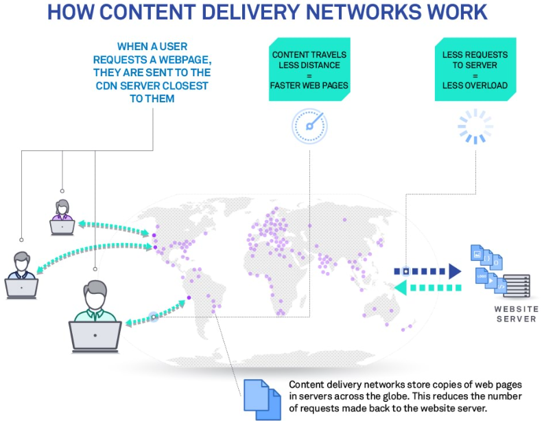

Main CDN Providers:

- AWS CloudFront
- Google Cloud CDN
- Microsoft Azure CDN
- Akamai
- CloudFlare

---

### Chapter 09. Resiliency

Things that can fail:

- a single server
- an entire rack
- an entire data center or "availability zone"
- an entire region
- an entire country
- an entire continent ...

Things that can cause failure:

- a bug in the system
- a hacker hacks the system
- hardware failure
- a connection (network plug, switches, routers) goes down
- any other disaster like fire, flood, earthquake, etc.

One possible solution for resiliency is **Geographic routing**.

#### Geographic routing

Geographic routing (also called georouting or position-based routing) is a routing principle that relies on geographic
position information. It is mainly proposed for wireless networks and based on the idea that the source sends a message
to the geographic location of the destination instead of using the network address.

Geographic routing requires that each node can determine its own location and that the source is aware of the location
of the destination. With this information, a message can be routed to the destination without knowledge of the network
topology or a prior route discovery.

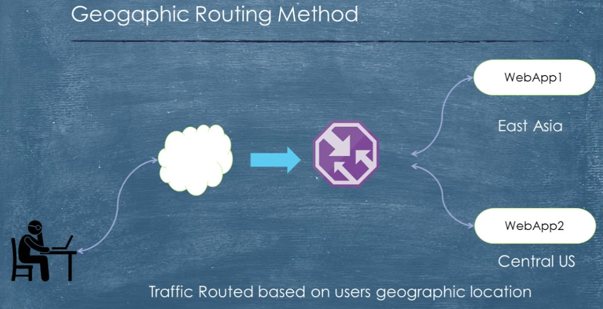

So in essence, we should have the following check list:

- back up servers or secondary servers should be spread across multiple racks, availability zones and regions
- over-provisioning of systems to ensure that system has enough capacity to survive a failure at any reasonable scale
- need to balance budget vs availability

---

